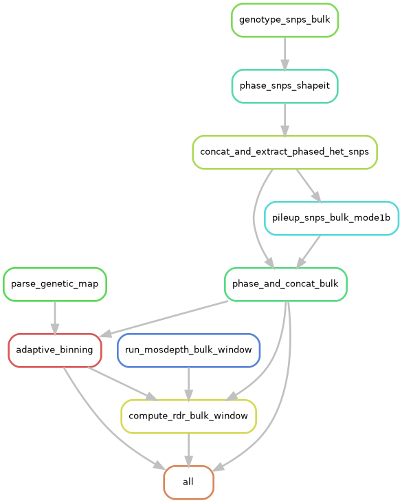
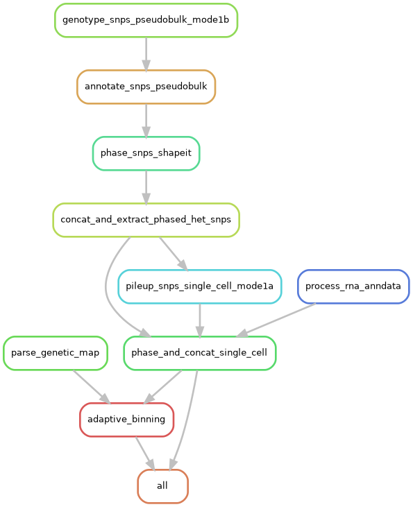

# Unified Genotyping Pipeline

A Snakemake pipeline for unified SNP genotyping, phasing, and allele counting across multiple assay types (bulk WGS/WES, scRNA, scATAC, VISIUM, VISIUM HD 3prime) from the same patient. Supports bulk genotyping, single-cell genotyping, and copy-typing preprocessing modes.

## Table of Contents

- [Quick-Start](#quick-start)
- [Workflow Overview](#workflow-overview)
- [Documentation](#documentation)

---

## Quick-Start

```sh
mamba env create -f ./environment.yaml -p /path/to/envs/genotyping_env
conda activate /path/to/envs/genotyping_env

# dry-run to check input files are formatted properly
snakemake --cores 1 \
    --dry-run \
    -s /path/to/workflow/Snakefile \
    --configfile config/config.yaml \
    --directory <output> \
    --config sample_file=/path/to/sample_file.tsv sample_id=<PATIENT_ID>

# run the pipeline
snakemake --cores <num_cores> \
    -s /path/to/workflow/Snakefile \
    --configfile config/config.yaml \
    --directory <output> \
    --config sample_file=/path/to/sample_file.tsv sample_id=<PATIENT_ID>
```

---

## Workflow Overview

### Bulk Genotyping



### Single-Cell Genotyping



---

## Documentation

| Document | Description |
|----------|-------------|
| [config/config.yaml](config/config.yaml) | Workflow configuration file. |
| [config/samples.tsv](config/samples.tsv) | Template of sample file. |
| [docs/step-by-step.md](docs/step-by-step.md) | Step-by-step guide for running all three workflow modes. |
| [docs/spec.md](docs/spec.md) | Input/output reference. |
| [resources/README.md](resources/README.md) | External data: SNP panels, phasing panels, GTF files, bias BEDs, phasing tools. |
